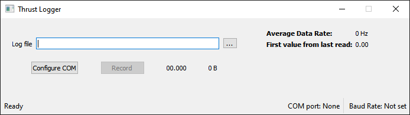
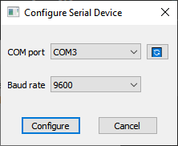
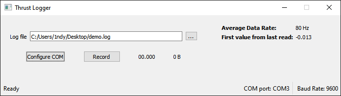
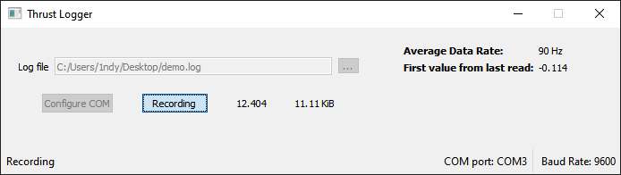

# ThrustLogger
ThrustLogger is custom built load cell-based thrust measurement platform used to characterize homemade rocket motor performance.

## Sections
 - [Hardware](#hardware)
 - [Building the Code](#building-the-code)
 - [Usage](#usage)
 - [Data](#data)
 - [Plans](#plans)

----------------------------------------

## Hardware
This tool is designed to read load measurements from a Sparkfun 
[HX711](https://www.sparkfun.com/products/13879) through an arduino via serial. I use a sparkfun redboard to communicate with the load cell amplifier but almost any board would work just fine. Here is what it looks like.

The black wire coming out of the HX711 goes to the actual [load cell](https://www.sparkfun.com/products/13331) (I know it's orange on the site, mine isn't). The resistence value is measured and converted on the HX711 and is made accesisble over I2C. The arduino reads this value and prints it in binary to the USB serial.

The yellow button is a tare (zeroing) button. The red button was for recording to the SD card in the lower left but I removed that functionality because the SD card was too slow. The red LED is likewise not used.

## Building the Code

ThrustLogger is built with CMake. The only dependency is Qt5. If Qt can't be found, make sure it is in your environment path.

## Usage

When the GUI launches, you can either start by selecting a file or configuring the COM device. If you choose to configure a COM device, you can still select a log file later.

ThrustLogger will search for active COM ports and populate the listbox. The button to the right of the listbox will rescan for COM devices. The baud rate defaults to 9600 because this is what I hardcoded into the arduino code but other options are available.

After configuring the COM device, you will see that the Average Data rate and first value fields are populated and updated in real time. These are a sanity check to makre sure the data is as expected. Once a log file has been selected, the record button will become clickable.

While recording, ThrustLogger will display the length of the recording in seconds and size in bytes. To stop recording, click the record button. The data is saved (flushed to disk) periodically during recording and any remaining bytes will be safely written to the log file when recording stops. This is in case of a catastrophic failure that damages the recording device.

## Data

The HX711 has slow and fast mode, selectable via a jumper on the bottom of the board. In slow mode, it offers data at 10 Hz. In fast mode, data is availabke at 80 Hz. I run it at 80 Hz because catastophic failures happen quickly and I want to collect as much information as possible.

Measurements are sent over USB serial as 4 byte floats. Even at 80 Hz, 9600 baud is more than sufficient for this application. Data is read from the serial connection on the host device and written to a user-selected output file periodically. Each measurement is separated by a system-specific newline. There are no timestamps in the data (yet).

## Plans

I've got a lot that I want to do with this program, mainly concerning data analysis. 

I am considering adding a live plot of thrust data but am not sure how useful it would be as I am not near the computer (and more importantly, test stand) during the burn. 

Currently I use a separate script to calculate impulse and specific impulse. This is time consuming because I need to pull the data into excel and trim it before analyzing it with the script. I'd like to add the ability to view, trim, and analyze data within ThrustLogger. I envision this as an optional step after data has been collected, or an option when a non-empty log file has been selected.

I've had a significant number of engine failures while testing. I typically have multiple cameras rolling, including one high speed camera (my phone), but lining up video frames with load measurements is tedious. I'd like to get a high frame rate (500+ fps) machine vision camera and add it to ThrustLogger. An infrared camera would also be nice.

I don't really like having to tare the load cell from the breadboard and want to add an option in software. This would require some changes to the arduino code as well.

